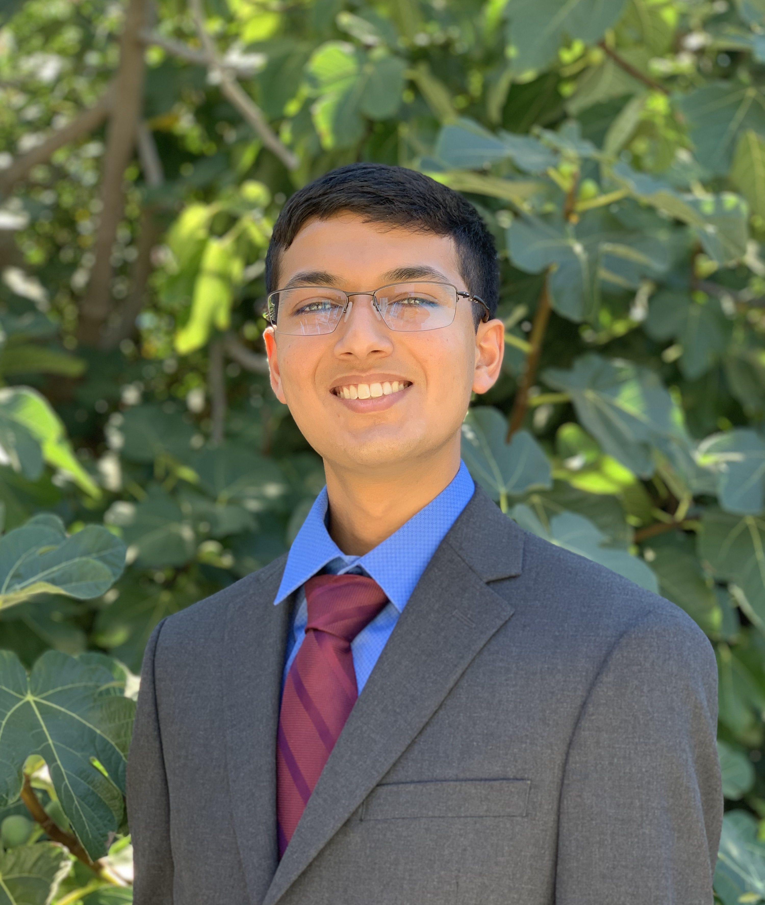

# Neelay Joglekar's User Page
## About me

I’m Neelay Joglekar, a 3rd year Computer Engineering major at UCSD who’s specifically enthusiastic about robotics. Much of my work is related to my research at the UCSD Advanced Robotics and Controls Lab (ARClab). My interests include computer vision, robotic manipulator control, autonomous navigation, modeling and simulation, and machine learning.

## Projects

- **Suture Thread Reconstruction**
  - Part of research with ARClab
  - Submitted paper to ICRA: [paper](https://arxiv.org/abs/2209.13657)
  - [repo](https://github.com/ucsdarclab/thread-reconstruction) (*Note: Will be updated upon acceptance*)
- **Chore Tracker**
  - Part of UCSD CSE 110 Software Engineering Project
  - [Link to app](https://stonks-chore-tracker.netlify.app/)
  - [repo](https://github.com/cse110-fa22-group28/cse110-fa22-group28)
- **Vehicle Trajectory Prediction**
  - Part of UCSD CSE 151b Deep Learning Competition, Spring 2022
  - [repo](https://github.com/brandonho667/151B-WinningProject)
